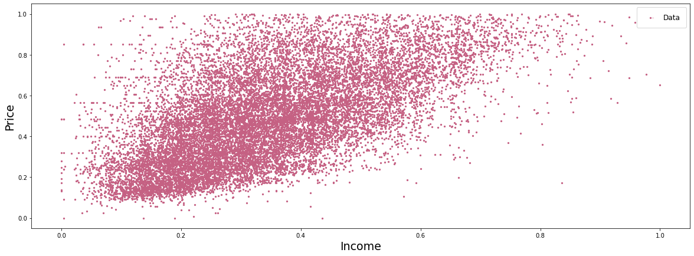
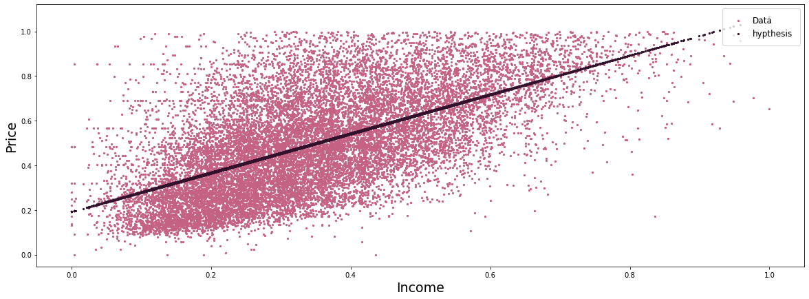

```python
import numpy as np
import pandas as pd
import matplotlib.pyplot as plt
from sklearn.datasets import _california_housing
from sklearn.metrics import mean_squared_error
```


```python
data = _california_housing.fetch_california_housing()
```


```python
features = pd.DataFrame(data.data, columns=data.feature_names)
target = pd.DataFrame(data.target, columns=['Target'])
```


```python
data_frame = features.join(target)
```


```python
data.feature_names
```


    ['MedInc',
     'HouseAge',
     'AveRooms',
     'AveBedrms',
     'Population',
     'AveOccup',
     'Latitude',
     'Longitude']


```python
data_frame.head()
```


<div>
<style scoped>
    .dataframe tbody tr th:only-of-type {
        vertical-align: middle;
    }

    .dataframe tbody tr th {
        vertical-align: top;
    }

    .dataframe thead th {
        text-align: right;
    }
</style>
<table border="1" class="dataframe">
  <thead>
    <tr style="text-align: right;">
      <th></th>
      <th>MedInc</th>
      <th>HouseAge</th>
      <th>AveRooms</th>
      <th>AveBedrms</th>
      <th>Population</th>
      <th>AveOccup</th>
      <th>Latitude</th>
      <th>Longitude</th>
      <th>Target</th>
    </tr>
  </thead>
  <tbody>
    <tr>
      <th>0</th>
      <td>8.3252</td>
      <td>41.0</td>
      <td>6.984127</td>
      <td>1.023810</td>
      <td>322.0</td>
      <td>2.555556</td>
      <td>37.88</td>
      <td>-122.23</td>
      <td>4.526</td>
    </tr>
    <tr>
      <th>1</th>
      <td>8.3014</td>
      <td>21.0</td>
      <td>6.238137</td>
      <td>0.971880</td>
      <td>2401.0</td>
      <td>2.109842</td>
      <td>37.86</td>
      <td>-122.22</td>
      <td>3.585</td>
    </tr>
    <tr>
      <th>2</th>
      <td>7.2574</td>
      <td>52.0</td>
      <td>8.288136</td>
      <td>1.073446</td>
      <td>496.0</td>
      <td>2.802260</td>
      <td>37.85</td>
      <td>-122.24</td>
      <td>3.521</td>
    </tr>
    <tr>
      <th>3</th>
      <td>5.6431</td>
      <td>52.0</td>
      <td>5.817352</td>
      <td>1.073059</td>
      <td>558.0</td>
      <td>2.547945</td>
      <td>37.85</td>
      <td>-122.25</td>
      <td>3.413</td>
    </tr>
    <tr>
      <th>4</th>
      <td>3.8462</td>
      <td>52.0</td>
      <td>6.281853</td>
      <td>1.081081</td>
      <td>565.0</td>
      <td>2.181467</td>
      <td>37.85</td>
      <td>-122.25</td>
      <td>3.422</td>
    </tr>
  </tbody>
</table>
</div>


```python
data_frame.shape
```


    (20640, 9)


```python
data_frame.corr()  # MedInc has relation with Target
```


<div>
<style scoped>
    .dataframe tbody tr th:only-of-type {
        vertical-align: middle;
    }

    .dataframe tbody tr th {
        vertical-align: top;
    }

    .dataframe thead th {
        text-align: right;
    }
</style>
<table border="1" class="dataframe">
  <thead>
    <tr style="text-align: right;">
      <th></th>
      <th>MedInc</th>
      <th>HouseAge</th>
      <th>AveRooms</th>
      <th>AveBedrms</th>
      <th>Population</th>
      <th>AveOccup</th>
      <th>Latitude</th>
      <th>Longitude</th>
      <th>Target</th>
    </tr>
  </thead>
  <tbody>
    <tr>
      <th>MedInc</th>
      <td>1.000000</td>
      <td>-0.119034</td>
      <td>0.326895</td>
      <td>-0.062040</td>
      <td>0.004834</td>
      <td>0.018766</td>
      <td>-0.079809</td>
      <td>-0.015176</td>
      <td>0.688075</td>
    </tr>
    <tr>
      <th>HouseAge</th>
      <td>-0.119034</td>
      <td>1.000000</td>
      <td>-0.153277</td>
      <td>-0.077747</td>
      <td>-0.296244</td>
      <td>0.013191</td>
      <td>0.011173</td>
      <td>-0.108197</td>
      <td>0.105623</td>
    </tr>
    <tr>
      <th>AveRooms</th>
      <td>0.326895</td>
      <td>-0.153277</td>
      <td>1.000000</td>
      <td>0.847621</td>
      <td>-0.072213</td>
      <td>-0.004852</td>
      <td>0.106389</td>
      <td>-0.027540</td>
      <td>0.151948</td>
    </tr>
    <tr>
      <th>AveBedrms</th>
      <td>-0.062040</td>
      <td>-0.077747</td>
      <td>0.847621</td>
      <td>1.000000</td>
      <td>-0.066197</td>
      <td>-0.006181</td>
      <td>0.069721</td>
      <td>0.013344</td>
      <td>-0.046701</td>
    </tr>
    <tr>
      <th>Population</th>
      <td>0.004834</td>
      <td>-0.296244</td>
      <td>-0.072213</td>
      <td>-0.066197</td>
      <td>1.000000</td>
      <td>0.069863</td>
      <td>-0.108785</td>
      <td>0.099773</td>
      <td>-0.024650</td>
    </tr>
    <tr>
      <th>AveOccup</th>
      <td>0.018766</td>
      <td>0.013191</td>
      <td>-0.004852</td>
      <td>-0.006181</td>
      <td>0.069863</td>
      <td>1.000000</td>
      <td>0.002366</td>
      <td>0.002476</td>
      <td>-0.023737</td>
    </tr>
    <tr>
      <th>Latitude</th>
      <td>-0.079809</td>
      <td>0.011173</td>
      <td>0.106389</td>
      <td>0.069721</td>
      <td>-0.108785</td>
      <td>0.002366</td>
      <td>1.000000</td>
      <td>-0.924664</td>
      <td>-0.144160</td>
    </tr>
    <tr>
      <th>Longitude</th>
      <td>-0.015176</td>
      <td>-0.108197</td>
      <td>-0.027540</td>
      <td>0.013344</td>
      <td>0.099773</td>
      <td>0.002476</td>
      <td>-0.924664</td>
      <td>1.000000</td>
      <td>-0.045967</td>
    </tr>
    <tr>
      <th>Target</th>
      <td>0.688075</td>
      <td>0.105623</td>
      <td>0.151948</td>
      <td>-0.046701</td>
      <td>-0.024650</td>
      <td>-0.023737</td>
      <td>-0.144160</td>
      <td>-0.045967</td>
      <td>1.000000</td>
    </tr>
  </tbody>
</table>
</div>


```python
data_frame[['MedInc', 'Target']].describe()  # max value is very bigger than 75% of data exammples
```


<div>
<style scoped>
    .dataframe tbody tr th:only-of-type {
        vertical-align: middle;
    }

    .dataframe tbody tr th {
        vertical-align: top;
    }

    .dataframe thead th {
        text-align: right;
    }
</style>
<table border="1" class="dataframe">
  <thead>
    <tr style="text-align: right;">
      <th></th>
      <th>MedInc</th>
      <th>Target</th>
    </tr>
  </thead>
  <tbody>
    <tr>
      <th>count</th>
      <td>20640.000000</td>
      <td>20640.000000</td>
    </tr>
    <tr>
      <th>mean</th>
      <td>3.870671</td>
      <td>2.068558</td>
    </tr>
    <tr>
      <th>std</th>
      <td>1.899822</td>
      <td>1.153956</td>
    </tr>
    <tr>
      <th>min</th>
      <td>0.499900</td>
      <td>0.149990</td>
    </tr>
    <tr>
      <th>25%</th>
      <td>2.563400</td>
      <td>1.196000</td>
    </tr>
    <tr>
      <th>50%</th>
      <td>3.534800</td>
      <td>1.797000</td>
    </tr>
    <tr>
      <th>75%</th>
      <td>4.743250</td>
      <td>2.647250</td>
    </tr>
    <tr>
      <th>max</th>
      <td>15.000100</td>
      <td>5.000010</td>
    </tr>
  </tbody>
</table>
</div>


```python
data_frame = data_frame[data_frame.Target < 3.2]
data_frame = data_frame[data_frame.MedInc < 9]
```


```python
data_frame[['MedInc', 'Target']].describe()
```


<div>
<style scoped>
    .dataframe tbody tr th:only-of-type {
        vertical-align: middle;
    }

    .dataframe tbody tr th {
        vertical-align: top;
    }

    .dataframe thead th {
        text-align: right;
    }
</style>
<table border="1" class="dataframe">
  <thead>
    <tr style="text-align: right;">
      <th></th>
      <th>MedInc</th>
      <th>Target</th>
    </tr>
  </thead>
  <tbody>
    <tr>
      <th>count</th>
      <td>17227.000000</td>
      <td>17227.000000</td>
    </tr>
    <tr>
      <th>mean</th>
      <td>3.419129</td>
      <td>1.655146</td>
    </tr>
    <tr>
      <th>std</th>
      <td>1.326086</td>
      <td>0.685940</td>
    </tr>
    <tr>
      <th>min</th>
      <td>0.499900</td>
      <td>0.149990</td>
    </tr>
    <tr>
      <th>25%</th>
      <td>2.414900</td>
      <td>1.097000</td>
    </tr>
    <tr>
      <th>50%</th>
      <td>3.250000</td>
      <td>1.608000</td>
    </tr>
    <tr>
      <th>75%</th>
      <td>4.250000</td>
      <td>2.181000</td>
    </tr>
    <tr>
      <th>max</th>
      <td>8.966900</td>
      <td>3.199000</td>
    </tr>
  </tbody>
</table>
</div>


```python
def normalize(arr):
    max = arr.max()
    min = arr.min()
    return pd.Series([(i - min) / (max - min) for i in arr])

X = normalize(data_frame.MedInc)
y = normalize(data_frame.Target)
```


```python
tmp = {'MedInc':X, 'Target':y}
data_frame = pd.DataFrame(data=tmp)
```


```python
data_frame.describe()
```


<div>
<style scoped>
    .dataframe tbody tr th:only-of-type {
        vertical-align: middle;
    }

    .dataframe tbody tr th {
        vertical-align: top;
    }

    .dataframe thead th {
        text-align: right;
    }
</style>
<table border="1" class="dataframe">
  <thead>
    <tr style="text-align: right;">
      <th></th>
      <th>MedInc</th>
      <th>Target</th>
    </tr>
  </thead>
  <tbody>
    <tr>
      <th>count</th>
      <td>17227.000000</td>
      <td>17227.000000</td>
    </tr>
    <tr>
      <th>mean</th>
      <td>0.344777</td>
      <td>0.493654</td>
    </tr>
    <tr>
      <th>std</th>
      <td>0.156618</td>
      <td>0.224971</td>
    </tr>
    <tr>
      <th>min</th>
      <td>0.000000</td>
      <td>0.000000</td>
    </tr>
    <tr>
      <th>25%</th>
      <td>0.226172</td>
      <td>0.310596</td>
    </tr>
    <tr>
      <th>50%</th>
      <td>0.324802</td>
      <td>0.478191</td>
    </tr>
    <tr>
      <th>75%</th>
      <td>0.442908</td>
      <td>0.666121</td>
    </tr>
    <tr>
      <th>max</th>
      <td>1.000000</td>
      <td>1.000000</td>
    </tr>
  </tbody>
</table>
</div>


```python
plt.figure(figsize=(20,7))
plt.scatter(X, y, label='Data', c='#C56183', s=5)
plt.xlabel('Income', fontsize=19)
plt.ylabel('Price', fontsize=19)
plt.legend(frameon=True, loc=1, fontsize=12, borderpad=.9)
plt.show()
```


    

    


```python
from sklearn import linear_model
model = linear_model.LinearRegression()
X = data_frame[['MedInc']]
y = data_frame[['Target']]
model.fit(X, y)
```


    LinearRegression()


```python
h = model.predict(X)
```


```python
plt.figure(figsize=(20,7))
plt.scatter(X, y, label='Data', c='#C56183', s=5)
plt.scatter(X, h, label='hypthesis', c='#31112C', s=5)

plt.xlabel('Income', fontsize=19)
plt.ylabel('Price', fontsize=19)
plt.legend(frameon=True, loc=1, fontsize=12, borderpad=.9)
plt.show()
```


    

    

